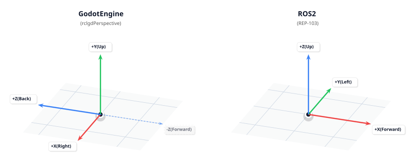

Transforms & Coordinate Systems
===============================

Handling 3D coordinate systems correctly is vital for seamless integration between Godot Engine and ROS 2. This page explains the architectural differences and how **rclgd** bridges them without sacrificing physical or rotational consistency.

Coordinate System Comparison
----------------------------

Both Godot 4 and ROS 2 utilize a **Right-Handed System (RHS)**, meaning standard 3D rotations follow the counter-clockwise Right-Hand Rule. However, their physical directional axes differ significantly.

* **ROS 2 (REP-103 Standard):** The standard convention for ground robots dictates that **+X points forward**, +Y points left, and +Z points up.
* **Godot Engine (Native 3D):** The native convention dictates that **-Z points forward**, +X points right, and +Y points up.

.. list-table:: System Axis Differences
   :widths: 30 35 35
   :header-rows: 1

   * - Feature
     - Godot Engine Convention
     - ROS 2 Standard (REP-103)
   * - **Coordinate System**
     - Right-Handed System (RHS)
     - Right-Handed System (RHS)
   * - **Forward Axis**
     - -Z (Forward)
     - +X (Forward)
   * - **Lateral Axis**
     - +X (Right)
     - +Y (Left)
   * - **Vertical Axis**
     - +Y (Up)
     - +Z (Up)

Visual Representation
---------------------

To maintain a Right-Handed System across both environments, mapping requires a double-axis inversion. Simply shuffling axes without signs inverts spatial handedness, mirroring 3D rotations and breaking physical simulations.

Axis Mapping in rclgd
---------------------

To ensure absolute compatibility with core ROS 2 navigation packages (like Nav2 and `robot_localization`), **rclgd** implements the standard **Ground Vehicle Convention**. 

By negating exactly two components (the ground plane axes), we preserve the Right-Hand Rule globally—ensuring positions, linear velocities, quaternions, and angular forces transfer flawlessly.

.. list-table:: Ground Vehicle Convention Reference
   :widths: 30 30 40
   :header-rows: 1

   * - Godot Direction
     - ROS 2 Direction (REP-103)
     - Vector Transformation Mapping
   * - **-Z (Forward)**
     - **+X (Forward)**
     - ``ros.x = -godot.z``
   * - **-X (Left)**
     - **+Y (Left)**
     - ``ros.y = -godot.x``
   * - **+Y (Up)**
     - **+Z (Up)**
     - ``ros.z =  godot.y``

GDScript Examples
-----------------

Manual Transform Conversion
~~~~~~~~~~~~~~~~~~~~~~~~~~~

The exact mapping used internally by the TF broadcaster and listener is exposed on the ``rclgd`` singleton as :ref:`godot_to_ros_vector<class_rclgd_method_godot_to_ros_vector>`, ``ros_to_godot_vector``, ``godot_to_ros_quat`` and ``ros_to_godot_quat``. Use these helpers whenever you build geometry by hand (poses, twists, odometry), so your data always agrees with what TF publishes:

.. code-block:: gdscript

    func godot_to_ros_transform(t: Transform3D) -> RosMsg:
        var msg = RosMsg.from_type("geometry_msgs/msg/Transform")

        # 1. Map Position (Origin)
        var pos = rclgd.godot_to_ros_vector(t.origin)
        msg.translation.x = pos.x
        msg.translation.y = pos.y
        msg.translation.z = pos.z

        # 2. Map Rotation (Quaternion)
        var q = rclgd.godot_to_ros_quat(t.basis.get_quaternion())
        msg.rotation.x = q.x
        msg.rotation.y = q.y
        msg.rotation.z = q.z
        msg.rotation.w = q.w

        return msg

Under the hood the vector helper applies the table above (``ros = Vector3(-godot.z, -godot.x, godot.y)``), and the quaternion helper shuffles the components the same way, which preserves structural symmetry and eliminates matrix shearing or skewing errors.

Using TF Broadcasters and Listeners
~~~~~~~~~~~~~~~~~~~~~~~~~~~~~~~~~~~

High-level objects like `RosTfBroadcaster` and `RosTfListener` abstract these conversions natively under the hood, transforming local scene trees directly into valid ROS 2 `/tf` configurations. Each broadcaster/listener belongs to the `RosNode` that created it, so transforms show up in the ROS graph under the node that publishes them.

.. code-block:: gdscript

    var broadcaster: RosTfBroadcaster
    var listener: RosTfListener

    func setup_tf_demo():
        # Instantiate interfaces from your custom ROS node instance
        broadcaster = ros_node.create_tf_broadcaster()
        listener = ros_node.create_tf_listener()

    func publish_my_move(t: Transform3D):
        # Broadcasts a local Godot transform instantly converted into the ROS vehicle frame
        # send_transform(transform, frame_id, parent_frame_id, is_static)
        broadcaster.send_transform(t, "base_link", "odom")

    func get_robot_position():
        # Looks up a ROS transform and returns a native Godot Transform3D
        # with inverse coordinate mappings applied automatically.
        # Returns null when the transform is not (yet) available.
        var t = listener.lookup_transform("odom", "base_link")
        if t != null:
            print("Robot Position in Godot space: ", t.origin)
            print("Robot Rotation Basis: ", t.basis)