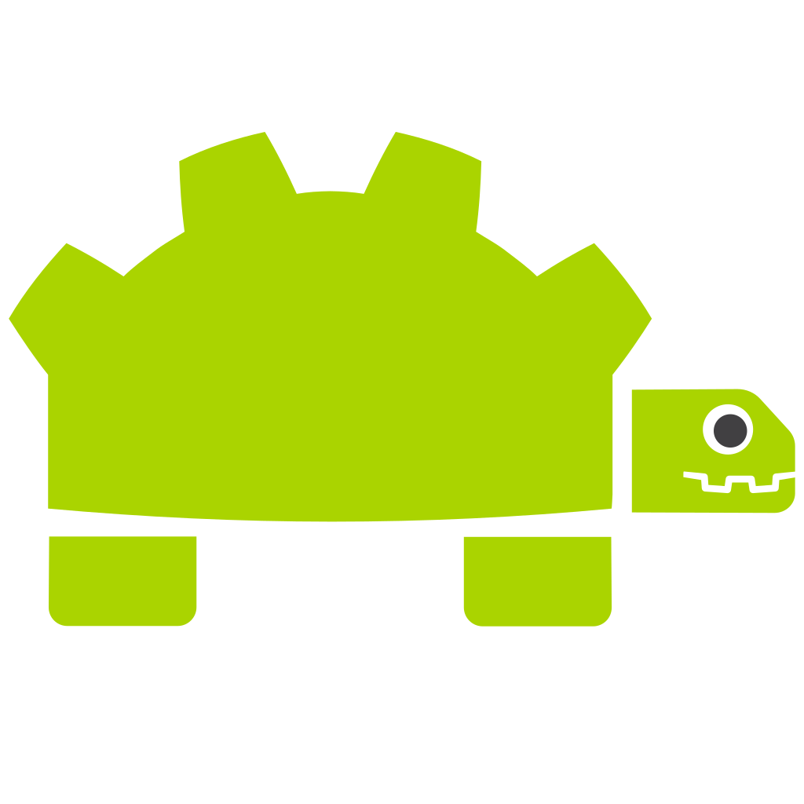

:allow_comments: False

rclgd Documentation
===================

Welcome to the documentation for **rclgd**, a ROS2 GDExtension for Godot Engine 4.
**rclgd** allows you to seamlessly integrate ROS2 into your Godot projects, providing high-performance communication and easy-to-use GDScript wrappers. Developed and maintained by **Ozuba**.

Motivation
----------

The **rclgd** library is designed to bring the power of ROS2 to Godot, enabling developers to build sophisticated robotic simulations, digital twins, and interface applications with ease.

- **Seamless Integration**: Use ROS2 nodes directly within Godot (now with Godot 4.7 support).
- **High Performance**: Built on top of `rclcpp` and `ros_babel_fish` for efficient message handling.
- **GDScript Friendly**: Simple and intuitive API for GDScript users, with typed message wrappers generated automatically from your package's dependencies.
- **Dynamic Messaging**: Support for custom ROS2 messages without recompilation thanks to BabelFish.
- **Full Communication Support**: Full support for Publishers, Subscribers, Timers, as well as awaitable Services and Actions.
- **Advanced ROS2 Features**: Comprehensive Quality of Service (QoS) support, parameters (including arrays) and simulation time.
- **First-class Tooling**: Godot projects are native colcon packages (``build_type: rclgd``), managed end to end by the ``ros2 rclgd`` command.

.. toctree::
   :hidden:
   :maxdepth: 2
   :caption: Getting Started
   :name: sec-get-started

   getting_started/installation
   getting_started/cli
   getting_started/introduction

.. toctree::
   :hidden:
   :maxdepth: 2
   :caption: Tutorials
   :name: sec-tutorials

   tutorials/basic_usage
   tutorials/make_rclgd_pkg
   tutorials/custom_messages
   tutorials/turtlesim_rclgd

.. toctree::
   :hidden:
   :maxdepth: 2
   :caption: Core Concepts
   :name: sec-concepts

   concepts/architecture
   concepts/transforms
   concepts/parameters_deep_dive

.. toctree::
   :hidden:
   :maxdepth: 1
   :caption: Class reference
   :name: sec-class-ref

   classes/index
