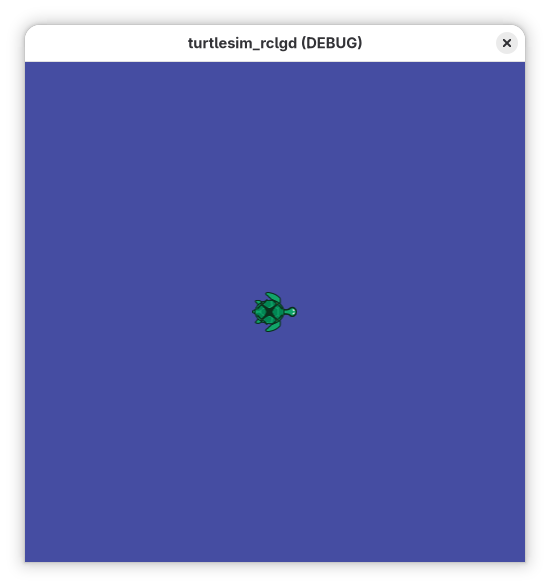

Building turtlesim_rclgd
==========================

This tutorial showcases how to build a fully-featured ROS 2 Node in Godot 4 using ``rclgd``. We will look at snippets from the ``turtlesim_rclgd`` package—a 100% native Godot reimplementation of the classic ``ros2_tutorials/turtlesim``.

Through this example, you will see how to leverage ``RosNode``, Publishers, Subscribers, Services, and Parameters using GDScript.
All code for this example is at `turtlesim_rclgd <https://github.com/Ozuba/turtlesim_rclgd>`_.

----------------------------------

1. Initializing the ROS 2 Node
------------------------------

Before you can communicate over the ROS network, the global ``rclcpp`` context must be initialized. In our ``world.gd`` script (attached to the main Godot scene), we ensure the context is active and spin up a new Node:

.. code-block:: gdscript

    extends Node2D

    var ros_node: RosNode

    func _ready():
        # 1. Initialize the global ROS 2 context if missing
        if not rclgd.ok():
            rclgd.init()
            
        # 2. Instantiate a new native RosNode
        ros_node = RosNode.new()
        ros_node.init("turtlesim")
        
        # Now the node is visible on the network as /turtlesim

----------------------------------

2. Publishers and Subscribers
-----------------------------

Our Turtle node needs to dynamically create topics matching standard ROS 2 message types (like ``geometry_msgs/msg/Twist``).

Subscribing to Velocity (cmd_vel)
^^^^^^^^^^^^^^^^^^^^^^^^^^^^^^^^^

We create a subscriber during the turtle's setup. The callback automatically receives a dynamically mapped ``RosMsg`` object representing the ``Twist``:

.. code-block:: gdscript

    var cmd_vel_sub: RosSubscriber
    var linear_vel: float = 0.0
    var angular_vel: float = 0.0

    func setup(turtle_name: String):
        # Create the Subscriber:
        cmd_vel_sub = ros_node.create_subscription("/" + turtle_name + "/cmd_vel", "geometry_msgs/msg/Twist", _on_cmd_vel)

    # Handling the callback data:
    func _on_cmd_vel(msg: RosMsg):
        linear_vel = msg.linear.x
        angular_vel = msg.angular.z

Publishing Pose
^^^^^^^^^^^^^^^

In our physics loop, we continuously publish our Godot ``position`` back to ROS by creating a ``RosMsg`` from a type string:

.. code-block:: gdscript

    var pose_pub: RosPublisher

    func setup(turtle_name: String):
        pose_pub = ros_node.create_publisher("/" + turtle_name + "/pose", "turtlesim/msg/Pose")

    func _publish_pose():
        var msg = RosMsg.from_type("turtlesim/msg/Pose")
        
        # Convert Godot pixel coordinates to standard Turtlesim meters
        msg.x = position.x / 50.0
        msg.y = (500.0 - position.y) / 50.0 
        msg.theta = rotation            
        msg.linear_velocity = linear_vel
        msg.angular_velocity = angular_vel
        
        pose_pub.publish(msg)

----------------------------------

3. Creating and Using Services
------------------------------

Services handle one-off remote procedural calls (like spawning a new turtle). ``rclgd`` handles service callbacks natively.

Hosting a Service Server
^^^^^^^^^^^^^^^^^^^^^^^^

In ``world.gd``, we host the ``/spawn`` service:

.. code-block:: gdscript

    var spawn_srv: RosService

    func _ready():
        # ... [node init] ...
        spawn_srv = ros_node.create_service("/spawn", "turtlesim/srv/Spawn", _on_spawn)

    # The callback receives a Request and Response RosMsg. Fill the response
    # in place — it is sent when the callback returns.
    func _on_spawn(req: RosMsg, res: RosMsg):
        var name = req.name
        if name == "":
            name = "turtle" + str(turtles.size() + 1)
        res.name = name  # Modify the response directly

        # Instantiate our Godot scene on the main thread (see the tip below)
        spawn_turtle.call_deferred(name, Vector2(req.x * 50.0, 500.0 - req.y * 50.0), req.theta)

Threading in Callbacks
^^^^^^^^^^^^^^^^^^^^^^

.. tip::
    **Crucial Detail:** Behind the scenes, ``rclgd`` executes the actual ROS C++ callbacks in a background thread, but marshals **topic, timer and action** GDScript callbacks back to Godot's main thread using ``call_deferred`` — you can safely touch the SceneTree from those. **Service server callbacks are the exception**: they run synchronously on the executor thread (the response must be filled before returning to the client), so defer any scene mutation with ``call_deferred``.

``turtle.gd`` handles the teleportation service accordingly — the response is
filled in place, while the scene change is deferred to the main thread:

.. code-block:: gdscript

    func _on_teleport_absolute(req: RosMsg, _res: RosMsg):
        # Service callback: executor thread! Defer the scene mutation.
        _apply_teleport.call_deferred(Vector2(req.x * 50.0, 500.0 - req.y * 50.0), req.theta)

    func _apply_teleport(pos: Vector2, theta: float):
        position = pos
        rotation = theta

----------------------------------

4. Handling ROS 2 Parameters
----------------------------

Modern ROS 2 configuring is heavily parameter-driven. We can use ``rclgd`` to declare parameters and react to changes (like a user running ``ros2 param set``) using native Godot Signals.

.. code-block:: gdscript

    func _ready():
        # ... [node init] ...

        # Declare defaults:
        ros_node.declare_parameter("background_r", 69)
        ros_node.declare_parameter("background_g", 77)
        ros_node.declare_parameter("background_b", 162)

        # Connect the parameter update signal:
        ros_node.parameter_changed.connect(_on_parameter_changed)

    # Reading them dynamically to paint our background Node:
    func _update_background_color():
        var r = ros_node.get_parameter("background_r")
        var g = ros_node.get_parameter("background_g")
        var b = ros_node.get_parameter("background_b")
        
        $Background.color = Color8(int(r), int(g), int(b))

    func _on_parameter_changed(name: String, value: Variant):
        # Instantly applies the new RGB value to the UI canvas!
        if name.begins_with("background_"):
            _update_background_color()

----------------------------------

Conclusion
----------
By mapping ``rclcpp`` constructs to GDScript classes (``RosNode``, ``RosPublisher``, ``RosService``) and dynamic dictionaries (``RosMsg``), ``rclgd`` makes writing native ROS robots and simulators in Godot 4 fluid and powerful!
